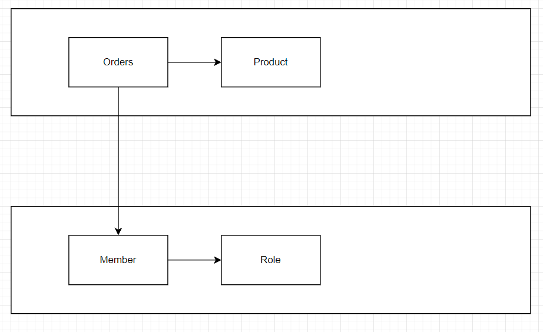

## 용어정리

|용어|영문명|의미|
|:---:|:---:|:---:|
|회원  |member |사용자는 로그인 및 회원가입|
|권한| role| 사용자의 권한
|상품  |product |회원이 주문하고자하는 상품 등록|
|금액| money| 상품금액|
|상품이름|name| 상품이름|
|상문주문|orders|사용자는 상품을 주문|
|상품상태|orderStatus|상품은 대기, 취소|
|토큰| token| 사용자 접근 키를 검증한다| 

# 요구사항 명세서 

- [x] 회원가입
  - id 회원별 고유한 아이디 
  - email 회원별 고유한 email 
  - password
- [x] 로그인
- [x] 로그아웃
- [x] 상품
  - 상품명, 상품금액
- [x] 상품조회
- [x] 상품주문
- [x] 회원주문내역조회 

# 🔷 사용자 스토리

## 회원 
- 사용자는 회원가입을 진행한다.
- 사용자는 로그인시 토큰 값을 얻는다.

### 회원 필수 값 
- email, password 필수이다.
- 유저의 권한

---

## 상품주문
- 사용자가 로그인한 경우 상품 주문 가능

### 상품주문 필수 값
- 고유한 주문번호
- 상품을 주문한 회원 키
- 주문한 상품
- 주문한 상태

---
## 회원 주문 내역
- 상품의 주문시 해당 사용자의 상품 내역을 저장한다.

### 회원 주문내역 필수 값
- 주문상품번호 (주문일(8)+ KM(크몽) + 상품번호 + 회원번호)
- 주문상품_ID
- 주문 상태 
- 주문생성일자
---

# 실행방법
## 도커 실행
> docker run -p 8080:8080 seunghoona/kmong:0.2

## API 문서
> http://localhost:8080/docs/index.html

## 의존성 구조

--- 

# 클래스 정리 

### 사용자 관련 주요 클래스 
|클래스명| 용도| 
|:---:|:---:|
|AuthenticationFilter| 사용자 토큰을 생성 필터 | 
|AUthenticationToken| 사용자 검증을위한 토큰생성 |
|AuthenticationProvider| 사용자 로그인을 검증|
|AuthenticationSuccessHandler| 토큰 생성|
|JwtAuthenticationFilter| 사용자 토큰 검증 필터|
|Token| 사용자 토큰 검증 용도|
